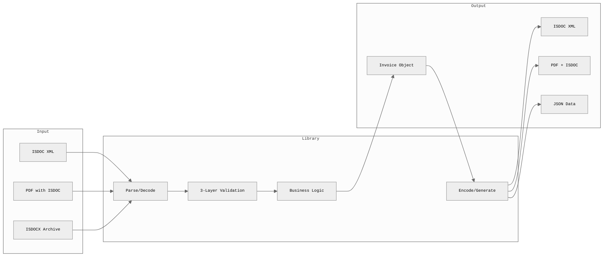
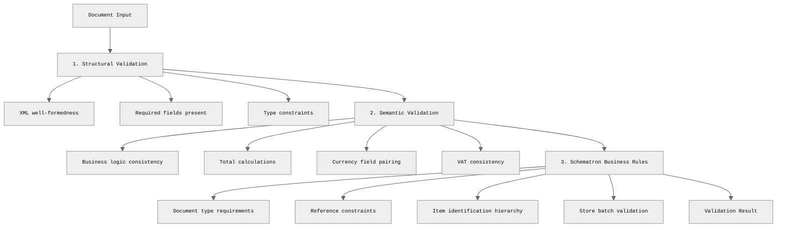

<h1 align="center">ISDOC</h1>

<p align="center">
  <strong>Complete ISDOC v6.0.2 implementation for Go</strong><br>
  Production-ready electronic invoicing format
</p>

<p align="center">
    <a href="#quick-start">Quick Start</a> •
    <a href="#features">Features</a> •
    <a href="#cli-usage">CLI</a> •
    <a href="#ffi-shared-library">FFI</a> •
</p>

## What is ISDOC?

**ISDOC** (Information System Document) is the Czech national standard for
electronic invoicing, adopted in 2009. It enables structured exchange of invoice
and document data between accounting systems with:

- **Automated Processing** - Machine-readable XML format
- **Validation** - Built-in business rules
- **PDF Integration** - Embed XML in human-readable PDFs
- **Wide Adoption** - Standard in Czech Republic since 2009

## Features

| Feature               | Description                                                  |
| --------------------- | ------------------------------------------------------------ |
| **Full ISDOC v6.0.2** | Complete implementation of Czech invoicing standard          |
| **Smart Validation**  | Multi-layer validation with business rules                   |
| **PDF Integration**   | Extract and embed ISDOC in PDF files                         |
| **Archive Support**   | Work with ISDOCX ZIP archives and attachments                |
| **Multi-Language**    | Go library, CLI tool, and FFI for Python/PHP/Java/Swift etc. |
| **Production Ready**  | Type-safe, tested, and compliant with official standards     |

## How It Works



### Validation Layers



## Installation

### CLI Binary

```bash
go install github.com/xseman/isdoc/cmd/isdoc@latest
```

### Linux Packages

Install using system package managers:

```bash
# Debian/Ubuntu (.deb)
curl -LO https://github.com/xseman/isdoc/releases/latest/download/isdoc_VERSION_amd64.deb
sudo dpkg -i isdoc_VERSION_amd64.deb

# RHEL/CentOS/Fedora (.rpm)
curl -LO https://github.com/xseman/isdoc/releases/latest/download/isdoc-VERSION.x86_64.rpm
sudo rpm -i isdoc-VERSION.x86_64.rpm
```

### Pre-built Binaries

Download pre-built binaries from [GitHub Releases](https://github.com/xseman/isdoc/releases):

```bash
# Linux (x86_64)
curl -LO https://github.com/xseman/isdoc/releases/latest/download/isdoc-linux-amd64
chmod +x isdoc-linux-amd64

# Linux (ARM64)
curl -LO https://github.com/xseman/isdoc/releases/latest/download/isdoc-linux-arm64
chmod +x isdoc-linux-arm64

# macOS (Apple Silicon)
curl -LO https://github.com/xseman/isdoc/releases/latest/download/isdoc-darwin-arm64
chmod +x isdoc-darwin-arm64

# Windows (x86_64)
curl -LO https://github.com/xseman/isdoc/releases/latest/download/isdoc-windows-amd64.exe
```

### FFI Shared Library

Download pre-built shared libraries for FFI integration:

```bash
# Linux (x86_64)
curl -LO https://github.com/xseman/isdoc/releases/latest/download/libisdoc-linux-amd64.so

# macOS (Apple Silicon)
curl -LO https://github.com/xseman/isdoc/releases/latest/download/libisdoc-darwin-arm64.dylib

# Windows (x86_64)
curl -LO https://github.com/xseman/isdoc/releases/latest/download/libisdoc-windows-amd64.dll
```

## Quick Start

### 1. Parse an Invoice

```go
package main

import (
    "fmt"
    "log"
    "os"
    "github.com/xseman/isdoc"
)

func main() {
    // Read ISDOC XML file
    data, _ := os.ReadFile("invoice.isdoc")

    // Parse to Invoice object
    invoice, err := isdoc.DecodeBytes(data)
    if err != nil {
        log.Fatal(err)
    }

    // Access invoice data
    fmt.Printf("Invoice: %s\n", invoice.ID)
    fmt.Printf("Date: %s\n", invoice.IssueDate)
    fmt.Printf("Total: %s %s\n",
        invoice.LegalMonetaryTotal.PayableAmount,
        invoice.LocalCurrencyCode)
}
```

### 2. Validate an Invoice

```go
// Parse invoice
invoice, _ := isdoc.DecodeBytes(data)

// Run all validation layers
errs := isdoc.ValidateInvoice(invoice)

// Check for blocking errors
if errs.HasErrors() {
    for _, e := range errs.Errors() {
        fmt.Printf("[%s] %s: %s\n", e.Severity, e.Field, e.Msg)
    }
}

// Warnings are non-blocking
for _, w := range errs.Warnings() {
    fmt.Printf("[WARNING] %s: %s\n", w.Field, w.Msg)
}
```

### 3. Create and Encode an Invoice

```go
import (
    "github.com/xseman/isdoc"
    "github.com/xseman/isdoc/schema"
    "github.com/xseman/isdoc/types"
)

invoice := &schema.Invoice{
    Version:      "6.0.2",
    DocumentType: 1, // 1=Invoice, 2=Credit Note, 3=Debit Note
    ID:           "FV-2025-001",
    UUID:         types.MustUUID("12345678-1234-1234-1234-123456789012"),
    IssueDate:    types.MustParseDate("2025-01-20"),

    LocalCurrencyCode: "CZK",
    CurrRate:         types.MustDecimal("1"),

    AccountingSupplierParty: schema.AccountingSupplierParty{
        Party: schema.Party{
            PartyName: schema.PartyName{Name: "My Company Ltd."},
            // ... more supplier details
        },
    },

    InvoiceLines: schema.InvoiceLines{
        InvoiceLine: []schema.InvoiceLine{
            {
                ID: "1",
                Item: schema.Item{Description: "Product/Service"},
                LineExtensionAmount: types.MustDecimal("1000.00"),
                // ... more line details
            },
        },
    },

    LegalMonetaryTotal: schema.LegalMonetaryTotal{
        TaxExclusiveAmount: types.MustDecimal("1000.00"),
        TaxInclusiveAmount: types.MustDecimal("1210.00"),
        PayableAmount:      types.MustDecimal("1210.00"),
    },
}

// Validate before encoding
if errs := isdoc.ValidateInvoice(invoice); errs.HasErrors() {
    log.Fatal(errs)
}

// Generate XML
xmlData, err := isdoc.EncodeBytes(invoice)
if err != nil {
    log.Fatal(err)
}

os.WriteFile("invoice.isdoc", xmlData, 0644)
```

### 4. Work with CommonDocument (Non-Payment Documents)

```go
// CommonDocument is for contracts, certificates, and other non-payment docs
doc, err := isdoc.DecodeCommonDocumentBytes(data)
if err != nil {
    log.Fatal(err)
}

fmt.Printf("Document: %s (Type: %s)\n", doc.ID, doc.SubDocumentType)

// Validate CommonDocument
errs := isdoc.ValidateCommonDocument(doc)
if errs.HasErrors() {
    log.Fatal(errs)
}

// Encode back to XML
xmlData, err := isdoc.EncodeCommonDocumentBytes(doc)
```

### 5. PDF Operations

```go
import "github.com/xseman/isdoc/pdf"

// Extract ISDOC from PDF
reader := pdf.NewReader()
result, err := reader.ReadFile("invoice.pdf")
if err != nil {
    log.Fatal(err)
}

// result.XML contains the embedded ISDOC XML
invoice, _ := isdoc.DecodeBytes(result.XML)

// Embed ISDOC into PDF (creates PDF/A-3 compliant file)
writer := pdf.NewWriter()
err = writer.WriteFile("template.pdf", xmlData, "invoice-with-isdoc.pdf")
```

### 6. ISDOCX Archives (ZIP with Attachments)

```go
import "github.com/xseman/isdoc/archive"

// Create archive with invoice and attachments
arch := archive.NewArchive("invoice.isdoc")
arch.AddAttachment("contract.pdf", contractData)
arch.AddAttachment("logo.png", logoData)

// Write to ZIP file
err := arch.WriteFile("invoice.isdocx")

// Read archive
readArch, err := archive.ReadFile("invoice.isdocx")
xmlData, _ := readArch.ReadMainDocument()
invoice, _ := isdoc.DecodeBytes(xmlData)
```

## API Overview

### Core Functions

| Function                                     | Purpose                     | Example                                             |
| -------------------------------------------- | --------------------------- | --------------------------------------------------- |
| `DecodeBytes([]byte)`                        | Parse ISDOC Invoice XML     | `invoice, err := isdoc.DecodeBytes(data)`           |
| `ValidateInvoice(*Invoice)`                  | Validate invoice (3 layers) | `errs := isdoc.ValidateInvoice(inv)`                |
| `EncodeBytes(*Invoice)`                      | Generate ISDOC XML          | `xml, err := isdoc.EncodeBytes(inv)`                |
| `DecodeCommonDocumentBytes([]byte)`          | Parse CommonDocument        | `doc, err := isdoc.DecodeCommonDocumentBytes(data)` |
| `ValidateCommonDocument(*CommonDocument)`    | Validate non-payment doc    | `errs := isdoc.ValidateCommonDocument(doc)`         |
| `EncodeCommonDocumentBytes(*CommonDocument)` | Generate CommonDocument XML | `xml, err := isdoc.EncodeCommonDocumentBytes(doc)`  |

### Document Types

| Type               | Root Element       | Use Case         | Examples                                          |
| ------------------ | ------------------ | ---------------- | ------------------------------------------------- |
| **Invoice**        | `<Invoice>`        | Tax documents    | Invoice, Credit Note, Debit Note, Advance Invoice |
| **CommonDocument** | `<CommonDocument>` | Non-payment docs | Contracts, Certificates, Agreements               |

### Custom Types

The `types` package provides validated types that prevent common errors. See [types/](types/) for implementation details.

- `Decimal` - String-backed decimal to prevent floating-point drift
- `Date` - YYYY-MM-DD format with validation
- `Bool` - Strict true/false only (rejects 0/1)
- `UUID` - 36-character UUID with pattern validation

```go
import "github.com/xseman/isdoc/types"

amount := types.MustDecimal("1234.56")
date := types.MustParseDate("2025-01-20")
uuid := types.MustUUID("12345678-1234-1234-1234-123456789012")
flag := types.Bool(true)
```

## CLI Usage

### Installation

```bash
# Install CLI binary
go install github.com/xseman/isdoc/cmd/isdoc@latest

# Or build from source
go build -o isdoc ./cmd/isdoc
```

### Commands

```bash
# Validate an ISDOC document
isdoc validate invoice.isdoc

# Extract ISDOC XML from PDF
isdoc extract invoice.pdf > invoice.isdoc

# Embed ISDOC XML into PDF
isdoc embed invoice.pdf invoice.isdoc output.pdf

# Convert ISDOC to JSON
isdoc convert invoice.isdoc > invoice.json

# Display help
isdoc --help
```

### Examples

See [examples/cli/](examples/cli/) for ready-to-run shell scripts:

- [validate.sh](examples/cli/validate.sh) - Validate ISDOC files
- [encode-decode.sh](examples/cli/encode-decode.sh) - Round-trip encoding/decoding

Run the examples:

```bash
cd examples/cli
./validate.sh
./encode-decode.sh
```

See [cmd/isdoc/](cmd/isdoc/) for CLI implementation details and [examples/README.md](examples/README.md) for all available examples.

## Validation Rules

The library implements official ISDOC 6.0.2 Schematron business rules. See [validate.go](validate.go) for implementation.

### Schematron Rules Reference

| Rule ID   | Rule Name                   | Description                                                                                |
| --------- | --------------------------- | ------------------------------------------------------------------------------------------ |
| **R-001** | Original Document Reference | Credit notes (2), debit notes (3), and advance credit (6) must reference original document |
| **R-002** | Currency Consistency        | When `ForeignCurrencyCode` is set, all `*Curr` fields must be populated                    |
| **R-003** | Domestic Currency           | Without `ForeignCurrencyCode`, no `*Curr` fields allowed, `CurrRate` must be 1             |
| **R-004** | Currency Mismatch           | `LocalCurrencyCode` and `ForeignCurrencyCode` must be different                            |
| **R-005** | VAT Consistency             | `VATApplicable=false` invoices cannot have lines with VAT                                  |
| **R-006** | Item Identification         | Tertiary ID requires Secondary, Secondary requires Primary                                 |
| **R-007** | Store Batch Validation      | Batch quantities must match `InvoicedQuantity`, unit codes must match                      |

Validation returns errors (blocking) and warnings (non-blocking).
Use `ValidateInvoiceWithOptions()` for custom validation behavior.
See [validate.go](validate.go) for all validation rules.

## Multi-Language Support

Native Go implementation with FFI shared library for Python, PHP, Java, Swift integration. Standalone implementations also available:

| Language       | Location                                  | Implementation              |
| -------------- | ----------------------------------------- | --------------------------- |
| **Go**         | [/isdoc](.)                               | Native, CLI, shared library |
| **PHP**        | [/isdoc-php](../isdoc-php/)               | Native + FFI support        |
| **TypeScript** | [/isdoc-typescript](../isdoc-typescript/) | Native                      |

All implementations share ISDOC v6.0.2 standard compliance.

### FFI Shared Library

Build C-compatible shared library:

```bash
make build-ffi  # Creates: bin/libisdoc.{so,dylib,dll}
```

API functions: `isdoc_parse()`, `isdoc_parse_common_document()`,
`isdoc_validate()`, `isdoc_marshal()`, `isdoc_free()`, `isdoc_version()`.

See [examples/ffi/](examples/ffi/) for integration examples in:

- [Python](examples/ffi/python/) - Using ctypes
- [PHP](examples/ffi/php/) - Using FFI extension
- [Java](examples/ffi/java/) - Using JNA
- [Swift](examples/ffi/swift/) - Using C interoperability

**Important:** Always call `isdoc_free()` on returned string pointers to
prevent memory leaks.

For a complete guide to all examples, see [examples/README.md](examples/README.md).

## Related

- [ISDOC v6.0.2 Specification](https://www.isdoc.org/downloads/isdoc-invoice-6.0.2.pdf)
- [Schematron Validation Rules](https://www.isdoc.org/downloads/isdoc-invoice-6.0.2.sch)
- [PHP Implementation](https://github.com/adawolfa/isdoc)
- [Node.js Implementation](https://github.com/deltazero-cz/node-isdoc)
- <https://github.com/isdoc/isdoc.pdf> - ISDOC.PDF format for embedding ISDOC in PDF
- <https://isdoc.cz/> - Official ISDOC website
- <https://github.com/isdoc/isdoc-xsd> - Official XSD schemas
- <https://www.isdoc.org/> - ISDOC documentation and specifications
